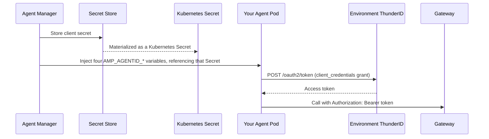

# Use AgentID in a Platform-Hosted Agent

Every Platform-Hosted agent automatically receives its own [AgentID](../concepts/agentid.mdx)
credential in every environment. Provisioning starts as soon as the agent is created, and happens
again whenever you promote it to a new environment. This guide shows what gets injected into
your agent's pod once it's running, and the code your agent needs to turn that injected
credential into a working access token for calling the gateway.

## Prerequisites

- A Platform-Hosted agent, created and deployed to at least one environment.
- Familiarity with reading environment variables in the language your agent is written in.

## What Gets Injected

Once your agent's AgentID finishes provisioning for an environment, Agent Manager injects four
environment variables into the agent's pod for that environment. No action is required on your
part to receive them.

| Environment variable | Description |
|---|---|
| `AMP_AGENTID_CLIENT_ID` | The OAuth 2.0 `client_id` for this agent in this environment. |
| `AMP_AGENTID_CLIENT_SECRET` | The OAuth 2.0 `client_secret`, delivered as a Kubernetes secret reference rather than a plain value in the pod spec. |
| `AMP_AGENTID_TOKEN_ENDPOINT` | The `/oauth2/token` endpoint of this environment's ThunderID instance. |
| `AMP_AGENTID_SCOPES` | The scopes to request when minting a token. |



:::note
These variables are injected automatically on deploy, on promotion to a new environment, and
refreshed automatically whenever the credential is regenerated. You never set them yourself, and
any value you set for these names in your agent's configuration is overwritten.
:::

## Step 1: Read the Environment Variables at Startup

Read all four variables when your agent process starts. Check them together, not just one:
they are injected as a single batch when provisioning completes, so treat any of the three
required values being missing the same way, as "identity not provisioned yet" rather than a
fatal error. Provisioning finishes asynchronously, shortly after deployment.

```python
import os

AGENT_IDENTITY_CLIENT_ID = os.environ.get("AMP_AGENTID_CLIENT_ID")
AGENT_IDENTITY_CLIENT_SECRET = os.environ.get("AMP_AGENTID_CLIENT_SECRET")
AGENT_IDENTITY_TOKEN_ENDPOINT = os.environ.get("AMP_AGENTID_TOKEN_ENDPOINT")
AGENT_IDENTITY_SCOPES = os.environ.get("AMP_AGENTID_SCOPES", "")


class AgentIdentityNotProvisionedError(Exception):
    """Raised when AgentID hasn't finished provisioning for this environment yet."""


def agent_identity_ready() -> bool:
    return all([AGENT_IDENTITY_CLIENT_ID, AGENT_IDENTITY_CLIENT_SECRET, AGENT_IDENTITY_TOKEN_ENDPOINT])
```

## Step 2: Mint and Cache a Token

Request a token using the `client_credentials` grant. Tokens are valid for about an hour, so
mint one and cache it instead of requesting a new token on every call. If your agent handles
requests concurrently, coalesce refreshes too: without it, every concurrent caller sees the
cache expired at the same moment and each fires its own token request.

```python
import threading
import time
import requests

_cached_token = None
_cached_token_expiry = 0
_cache_lock = threading.Lock()
_refresh_done = threading.Event()
_refresh_done.set()

def get_agent_access_token():
    global _cached_token, _cached_token_expiry

    with _cache_lock:
        if _cached_token and time.time() < _cached_token_expiry:
            return _cached_token

        if not agent_identity_ready():
            raise AgentIdentityNotProvisionedError(
                "AgentID has not finished provisioning for this environment yet"
            )

        # Only the first caller to see the cache expired refreshes it; everyone
        # else waits for that result below instead of firing its own request.
        is_refresher = _refresh_done.is_set()
        if is_refresher:
            _refresh_done.clear()

    if not is_refresher:
        _refresh_done.wait(timeout=15)
        return _cached_token

    try:
        response = requests.post(
            AGENT_IDENTITY_TOKEN_ENDPOINT,
            data={
                "grant_type": "client_credentials",
                "scope": AGENT_IDENTITY_SCOPES,
            },
            auth=(AGENT_IDENTITY_CLIENT_ID, AGENT_IDENTITY_CLIENT_SECRET),
            timeout=10,
        )
        response.raise_for_status()
        token_data = response.json()

        with _cache_lock:
            _cached_token = token_data["access_token"]
            # Refresh at 75% of the token's lifetime, so a slow refresh never leaves a gap.
            _cached_token_expiry = time.time() + (token_data["expires_in"] * 0.75)

        return _cached_token
    finally:
        _refresh_done.set()
```

The same request with `curl`, useful for a quick manual check from inside the pod:

```bash
curl -s -X POST "$AMP_AGENTID_TOKEN_ENDPOINT" \
  -u "$AMP_AGENTID_CLIENT_ID:$AMP_AGENTID_CLIENT_SECRET" \
  -d "grant_type=client_credentials" \
  -d "scope=$AMP_AGENTID_SCOPES"
```

## Step 3: Call the Gateway with the Token

Attach the token as a bearer token on every call your agent makes to an MCP tool through the
gateway. This does not change which URL your agent calls, only which credential rides along
with the call.

```python
headers = {
    "Authorization": f"Bearer {get_agent_access_token()}",
}
response = requests.post(
    mcp_gateway_url,
    headers=headers,
    json=payload,
    timeout=10,
)
```

## Rotation and Revocation

**Regenerating** a credential for this environment attempts to roll out your pod with the new
secret automatically. This is best-effort, the same as the initial injection: if the rollout
fails, the pod keeps running with the old, now-invalidated secret until you restart the
deployment yourself. When it succeeds, your agent does not need to detect anything itself: on
restart, it reads the new values from Step 1 and mints a fresh token as usual.

**Revoking** a credential is different. There is no new secret to hand the pod, so Agent Manager
instead removes the old AgentID environment variables from the running pod, again best-effort.
If that removal fails, the pod may keep referencing the revoked credential until it is
redeployed. A revoked credential stops new tokens from being minted, but does not invalidate a
token your agent already holds until that token naturally expires. If your agent suddenly
receives `401` responses from the gateway after a revoke, restart the deployment, then generate
a new credential: a revoke on its own only removes the old identity, a follow-up regenerate is
needed to restore access.

## Troubleshooting

| Symptom | Likely cause |
|---|---|
| The four environment variables are missing entirely | The agent's AgentID has not finished provisioning yet for this environment, or provisioning failed. Check the agent's identity status through the API described in [AgentID](../concepts/agentid.mdx#provisioning-and-retry). |
| Token request returns `invalid_client` | The environment's ThunderID instance rotated its own internal state, or the injected secret is stale. Regenerate the agent's credential for this environment. |
| Gateway rejects a valid token | The environment's gateway may not yet trust this environment's ThunderID instance. This is set up automatically when the environment is created, so this points to an environment configuration issue rather than your agent's code. |
