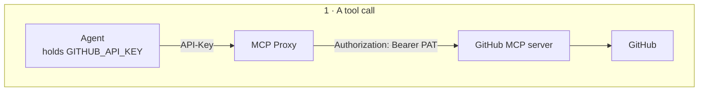

import Tabs from '@theme/Tabs';
import TabItem from '@theme/TabItem';

# Give the Agent Real Tools

Your agent already refuses to open duplicate tickets, it checks system status and
the employee's open tickets first. But AcmeCorp's IT team tracks known problems
somewhere the agent can't see: their GitHub issue tracker. So when three people
report mail client crashing after an update, the agent files three tickets for a
problem engineering already knows about.

You're going to give it a third place to look. Which immediately raises the
question the rest of this chapter answers: **once an agent can reach an outside system, what stops it doing damage there?**

Connecting the tools might takes a few minutes. Fencing them in is the part that
matters.

## What You'll Need

A **GitHub Personal Access Token** with **read access only**. Create a one at [here](https://github.com/settings/tokens). 

You'll also need a repository with a few issues in it to search — the IT team's
tracker in the story, any repository you can read in practice. Note its
`owner/repo` name; you'll hand it to the agent in Step 4 so it knows where to
look. Grant the token the read access; nothing here needs write scope.

## Step 1: Register GitHub as an MCP Proxy

MCP proxies are organization-level resources, like LLM providers. First go to the orgnization page in the agent manager console by clicking the icon next to the agent manager console.Go to
**MCP Servers** under **Resources** and click **Register MCP Server**.

| Field | Value |
|---|---|
| **Name** | `GitHub` |
| **Context path** | `/github` |

The name matters — it becomes the prefix of the environment variables Agent
Manager injects later, so `GitHub` gives you `GITHUB_URL` and `GITHUB_API_KEY`,
which is what the sample's `config.py` reads.

Configure the **upstream endpoint** for your development environment:

| Field | Value |
|---|---|
| **Endpoint Name** | `Primary` |
| **MCP Server Endpoint URL** | `https://api.githubcopilot.com/mcp/` |

Now Go to the **Advanced Configuration** tab and put these.
| Field | Value |
|---|---|
| **key** | `Authorization` |
| **value** | `Bearer <PAT>` |

Then click add endpoint after discovering the tools automatically by the agent manager.

Your PAT is now stored on the proxy, centrally — the agent will never see it.
Full field reference: [Register an MCP Proxy](../guides/register-mcp-proxy.mdx).

## Step 2: Discover What GitHub Offers

The proxy connects upstream and lists the tools the
server actually advertises — `search_issues`, `get_issue`, `create_issue`,
`update_issue`, `search_repositories`, `list_pull_requests`, and a good many more.

Read that list properly before moving on. This is the moment to notice that you're
about to hand an LLM a set of tools that includes places where things can go wrong if not controlled properly, and that you probably.

## Step 3: Fence the Tools In

On the endpoint's **Manage Tools** tab, switch the mode to **Deny all**, then
allow only what the helpdesk agent needs:

| Allow | Why |
|---|---|
| `search_issues` | Find a known issue matching what the employee reported |
| `issue_read` | Read it for status and any documented workaround |

Two tools. Everything else is now unreachable. Not discouraged by a
prompt. Unreachable, because the gateway does not expose the other tools via the [MCP proxy](../concepts/mcp-proxy.mdx)

That control matters most for the tools an agent could plausibly be tricked into using—actions that sound reasonable on the surface, but exceed the agent's actual authority.

Here's the whole path a tool call takes, and where each control sits:



Two things happen here that are worth separating.

The denied tools are never exposed.The proxy
filters the capability list on its way to the agent, so the agent's toolset
contains two tools and nothing else.

The PAT never travels left of the gateway.The agent authenticates with a
platform-issued key, and the gateway attaches the real credential on the way
out — so an agent that leaks its environment leaks nothing that works against
GitHub directly.

:::note
Access control needs the gateway to report the `mcp-acl-list` policy. If the tab
is disabled, your environment's gateway doesn't offer it — the same
gateway-determines-the-menu rule from Chapter 2.
:::

## Step 4: Attach the Proxy to the Agent

Back on the `it-helpdesk` agent page go to the configure page and then go to tool configuration and attach the newly registered MCP to the it helpdesk agent. Keep all the configuration of the MCP proxy as in default settings

<Tabs groupId="agent-hosting">
<TabItem value="platform" label="Platform-Hosted Agent" default>

Then Go to the Deploy page add these two new enviroment variables. For the demo purposes use a one from you own repos.

| Key | Value |
|---|---|
| `USE_MCP` | `true` |
| `ISSUE_TRACKER_REPO` | `acme/it-tooling` *(your `owner/repo`)* |

`ISSUE_TRACKER_REPO` is how the agent knows *where* to look. The sample puts it
into the system prompt and scopes every issue search to it. The sample refuses to start with
`USE_MCP=true` and no tracker repo, rather than silently searching everything.

Agent
Manager injects the mcp configurations per environment as system-managed values, deriving the names
from the proxy name you chose in Step 1. The sample loads its MCP tools from that
pair at startup and merges them with its nine built-in tools.

Redeploy.

:::tip Per-environment trackers
Because this is an ordinary environment variable, staging can point at a scratch
repository while production points at the real tracker — the same
per-environment pattern used for provider bindings in Chapter 2.
:::

</TabItem>
<TabItem value="external" label="Externally-Hosted Agent">

Retrieve the per-environment URL and API key from the proxy, then set them
yourself — the same pair, same names, just not injected:

```bash
export USE_MCP=true
export GITHUB_URL="<proxy endpoint URL for your environment>"
export GITHUB_API_KEY="<proxy API key>"
export ISSUE_TRACKER_REPO="acme/it-tooling"   # your owner/repo

amp-instrument python main.py
```

The variable names must match what the sample reads. Agent Manager derives them
from the proxy name (`GitHub` → `GITHUB_URL` / `GITHUB_API_KEY`), so if you named
the proxy something else, use the names the console shows you.

The governance is identical: the deny-list, the rewrite rules, and the upstream
PAT all live on the proxy, so your externally-hosted agent is fenced in exactly
as a platform-hosted one would be. It still never sees the GitHub credential.

</TabItem>
</Tabs>

:::note Restart to pick up tool changes
The sample discovers MCP tools once at startup. Widen the access-control list and
the running agent won't see the new tools until it restarts — a redeploy for
platform-hosted agents, a process restart for externally-hosted ones.
:::

## Step 5: Watch It Use Them

In **Try It**, report something that matches an issue in your tracker:

```text
Outlook keeps crashing on launch since yesterday's update. Is that known?
```

{/* SCREENSHOT: Try It console showing the agent citing a known issue instead of opening a ticket */}

The agent should search the tracker, find the matching issue, and tell the
employee its number and any workaround — instead of opening a duplicate ticket.
That's the "check before create" rule it already followed for outages and open
tickets, now reaching a live system rather than mock data.

Then try the request that sounds perfectly reasonable:

```text
That's fixed for me now — go ahead and close it.
```

It should refuse and point them at L2. But notice *why* it can't comply even if
the prompt failed to stop it: there is no close-issue tool in its toolset to
call. The prompt is the polite refusal; the proxy is the reason the capability
isn't there at all. This is exactly the request an agent is most likely to be
talked into, which is why it's the one worth making structurally impossible.

Open the trace. Alongside the familiar tool spans you'll now see spans for the
MCP calls, showing which tool ran and what came back. Everything the agent
touched, in one place.

## Step 6: Give the Agent an Identity

Access control answers *"which tools can be called through this proxy."* It
doesn't answer *"which agent is allowed to call them."*

That's what [AgentID](../concepts/agentid.mdx) is for. Every agent gets its own
identity in each environment it runs in — the agent is a subject in the same RBAC
system as your users, not an anonymous caller.

Define scopes on the proxy and grant them to your agent's identity through a role,
following [Authorize Agent Access to MCP Tools](../guides/authorize-agent-access-to-mcp-tools.mdx).
Scopes are proxy-wide — defined once, applying across every endpoint and
environment — which is why an agent's authorization doesn't quietly change as it's
promoted from development to production.

{/* SCREENSHOT: Scopes defined on the MCP proxy, and the role assignment granting them to the agent identity */}

Now three independent things must all be true for a call to succeed: the tool is
allowed by the deny-list, the agent's identity carries the scope, and the gateway
holds a valid upstream credential. No single mistake opens the door.

## What You've Built

The agent reaches a real external system, using a credential it has never seen,
through a fixed set of tools it cannot expand, under an identity that can be
audited and revoked.

## What's Next

The agent can now do real damage if it behaves badly — and you've only checked its
behavior by trying a handful of messages by hand. That doesn't scale, and it
doesn't prove anything.
