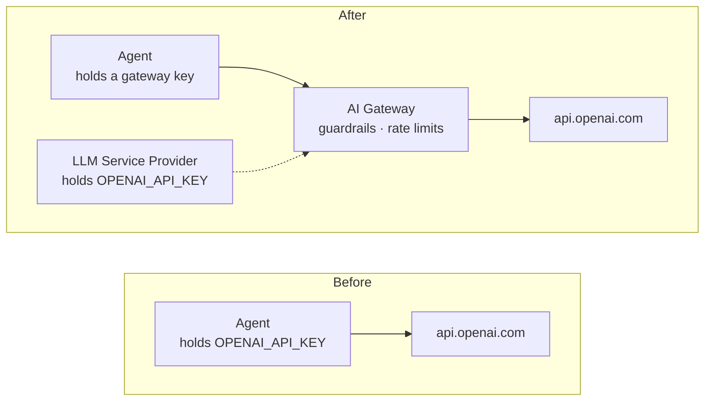

import Tabs from '@theme/Tabs';
import TabItem from '@theme/TabItem';

# Control what your agent respond to

Your helpdesk agent works. Then security team reviews it and files two objections:

1. Employees have discovered it will happily debug their personal
   side projects. It should refuse anything that isn't IT support.
2. Nobody can see what it's spending, and nothing stops one bad loop from burning
   the month's token budget.

The obvious fix is to edit the system prompt and redeploy — but that's rarely the right one. There can be situations like 

- Compliance teams might want update rules without relying on developers.
- Policy updates should go live immediately without waiting for a software release.
- Rules should be tracked in one central place instead of hiding them in prompt code.

Everything in this chapter happens **outside the agent**. Its code never changes.

## The Shape of the Fix

Right now the agent holds an OpenAI key and calls OpenAI directly. You're going to
put a [gateway](../concepts/gateway.mdx) in the middle:



The agent stops holding the upstream credential entirely. It gets a
platform-issued key and a gateway URL instead, and because every request now
passes through one place, that place can enforce things.
[LLM Service Provider](../concepts/llm-service-provider.mdx) explains why this
indirection exists.


## Step 1: Register OpenAI as an LLM Service Provider

"Providers are managed at the organization level, so a single registration can be shared across all projects. To set this up:

1. Switch to the Organization view in the Agent Manager console by clicking the organization icon next to the Agent Manager logo.
2. Go to Resources > LLM Service Providers.
3. Click Add Provider." (or your specific button label)
**+ Add Service Provider**.

| Field | Value |
|---|---|
| **Name** | `Shared OpenAI` |
| **Version** | `v1.0` |
| **Context path** | `/openai` |
| **Provider Template** | **OpenAI** |

Picking the template fills in the upstream URL, auth type, and API specification
for you. Then supply your OpenAI key as the **upstream credential** and click
**Add provider**.

The **Resilience** tab allows you to set timeout parameters, which are useful for long-lived connections. For this tutorial, the default values are sufficient. You can find additional details [here].

In this manner the key can be stored once, centrally. This is the payoff: when it rotates, you
edit it here and every agent using this provider picks it up — no redeployments,
and no agent ever held it.

## Step 2: Add the Guardrail

In the provider's **Guardrails** tab and click **+ Add Guardrail** 

In the serach tab put prompt decoratoe and Add a **Prompt Decorator** policy and give it an instruction along these lines:

For the prompt decorator config
```text
You handle IT support requests for AcmeCorp employees only: passwords, software
access, tickets, outages, and IT policy. If a request is not IT support, politely
decline and suggest the employee contact the relevant team. Never write code,
essays, or creative content.
```

keep the otheres in default configurations

Save it.

Next click ** Add Provider ** Now you will be redirected to the llm provider page that we have configured. 

Guardrails stack in three layers — global on the provider (what you just did),
per-operation on the provider, and per-agent on the binding you'll create in
Step 4. The agent-level ones apply *in addition to* these, so one team can be
stricter without imposing that on everyone.

## Step 4: Point the Agent at the Provider

Go back to your `it-helpdesk` agent, 
You should follow the Orgnaizationn lvel view > .default Project and then the agent
Open it's configure ssection and then go to the LLM configurations section
Then **+ Add LLM Configuration** to attach `Shared OpenAI` LLM provider that yiu have created previously.


Now this new configurations will be injected to the agent as enviroment varialbles and the variable names that will be appearing is shown in the Enviroment variable Names tab which will appear as OPENAI_URL and OPENAI_API_KEY and change the variable values to LLM_PROVIDER_URL and the LLM_PROVIDER_KEY.  Note that these values can be edited based on the way that you are refereincing the provider in your agent's codebase

Now save this and this will trigger a redeploy of the agent wait until the agent finsihes deploying

<Tabs groupId="agent-hosting">
<TabItem value="platform" label="Platform-Hosted Agent" default>

Now you have to make a small change to the enviroment variables section for that go to the agent's deploy section and in the default enviroment deployment card in the configurations and Secret section click configure


Now add this new enviroment variable
| Key | Value |
|---|---|
| `USE_LLM_PROVIDER` | `true` |

You do **not** add `LLM_PROVIDER_URL` or `LLM_PROVIDER_KEY`. Agent Manager injects
those as system-managed variables when the provider is attached — they're
read-only in the console, so the agent can't be repointed at an ungoverned
endpoint by editing its config. The sample's `config.py` reads exactly this pair.

You can now delete `OPENAI_API_KEY` from the agent. It doesn't need it any more.

Now click apply and this redeploy the agnt again since you have changed the envoroment variables of the agent

</TabItem>
<TabItem value="external" label="Externally-Hosted Agent">

There's no pod to inject into, so the platform hands you the values instead of
setting them. From the configuration panel, copy the **Endpoint URL** and
**API Key** for your environment, then set them where your agent runs:

```bash
export USE_LLM_PROVIDER=true
export LLM_PROVIDER_URL="<endpoint URL from the console>"
export LLM_PROVIDER_KEY="<API key from the console>"

unset OPENAI_API_KEY     # the agent no longer needs it

amp-instrument python main.py
```

The same three variables the platform would have injected, set by hand. Your
agent now calls the gateway rather than OpenAI, so the guardrail and the rate
limits apply to it identically — the governance doesn't depend on who runs the
workload, only on which URL the traffic goes to.

:::caution Copied values don't rotate themselves
This is the one place the external path is genuinely weaker. A platform-hosted
agent picks up a rotated upstream credential automatically, because it only ever
held the gateway key. Here, if you regenerate the provider's API key you must
update it wherever you exported it.
:::

</TabItem>
</Tabs>

## Step 5: Prove the Guardrail Works

In **Try It**, ask something off-topic:

```text
Write me a haiku about Kubernetes.
```

It should decline and steer you back to IT support. Then confirm you haven't
broken the real job:

```text
I need my password reset. alice.chen@acmecorp.com, E-1001.
```

{/* SCREENSHOT: Try It console showing the refused off-topic request next to a successful password reset */}

The agent's code, prompt, and tools are byte-for-byte what they were in Chapter 1.
The behavior changed because the request path changed.

## Step 6: Add Rate Limiting

Open the provider's **Rate Limiting** tab.

{/* SCREENSHOT: Rate Limiting tab showing provider-wide request and token count limits */}

Set a **Provider-wide** limit — a request-per-window ceiling and a token-per-window
ceiling. Start deliberately low, something you can hit in testing, then send
several messages in quick succession until you're throttled.

Limits apply at two scopes: provider level (everything through this provider) and
consumer level (per calling agent). Provider-wide protects the upstream API and
your bill; per-consumer stops one agent starving the others.

## What You've Built

Off-topic requests refused, spending capped, and one central credential — none of
which required touching the agent.

The division of labor here is the real lesson, and it maps onto
[roles](../concepts/organization.mdx#access-control): an **AI Lead** owns
providers and guardrails, a **Developer** owns the agent, and neither has to wait
on the other. A Developer can *connect* to a provider but not register or change
one.

## What's Next

The agent is governed, but it only knows about AcmeCorp's mock data. Employees
keep asking it for access to source code repositories — something it can't do,
because it has no tools that reach outside itself.

**[Chapter 3: Give the Agent Real Tools, Then Fence Them In →](./controlling-what-agents-can-access.mdx)**
