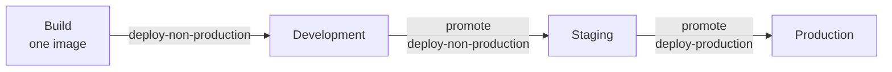

# Ship It to Production

*Chapter 5 of 5 — continues from [Measure the Agent](./observe-first-agent.mdx).*

The helpdesk agent works in development, it's governed, it has real tools it can't
abuse, and monitors that prove it behaves. Now it has to serve actual employees.

:::info This chapter needs a platform-hosted agent
Promotion, rollback, suspend, endpoint security, and isolation tiers are all
things Agent Manager can only do for a workload it runs. If your agent is
externally-hosted, follow along to understand the model — but the actions
themselves won't be available to you, and the deployment and endpoint security
stay your responsibility. Only [Step 7](#step-7-watch-it) applies to both.
:::

Production is not "development with a different URL". It's a different
environment, with different credentials, a different security posture, and — most
importantly — different people allowed to touch it.

## Step 1: Understand the Path

An agent doesn't jump to production. It follows the
[deployment pipeline](../concepts/deployment-pipeline.mdx) attached to the
`it-support` project you created in Chapter 1, which defines the order
environments may be traversed: typically development → staging → production.



One image is built once and moves rightward; each hop is a promotion, and the
last hop needs a permission the earlier ones don't.

{/* SCREENSHOT: Deployment pipeline view showing the environment progression for the project */}

If your installation only has a development environment, add staging and
production now — see [Environment Management](../guides/environment-management.mdx).
You need at least two to see a promotion happen.

The pipeline is a real constraint, not documentation. You cannot promote straight
from development to production if the pipeline says staging comes first.

## Step 2: Promote to Staging

From the agent's deployment view, promote the development deployment to staging.

{/* SCREENSHOT: Promote dialog showing source environment development and target staging */}

A promotion moves the *deployment*, not the build. The image that was tested in
development is the image that runs in staging — no rebuild, so nothing can drift
between what you tested and what you shipped.

What does **not** carry over automatically is configuration, and that's
deliberate. Staging should have its own:

- **LLM Service Provider binding** — perhaps a different model, or the same
  provider with a tighter rate limit.
- **MCP proxy endpoint** — point at a sandbox GitHub organization, not the real one.
- **`AGENT_VERSION`** — set it to something distinguishable, like `1.0.0-staging`.

That last one is why Chapter 1 had you set it. Call the staging endpoint:

```bash
curl -s <staging-endpoint>/health
```

The response echoes `agent_version`, so "which build is actually running here" is
a question you can answer in one request rather than by reading console pages.

## Step 3: Secure the Endpoint

Development was open because it was only you. Production is not.

Pick an authentication approach for the agent's endpoint:

- **[API keys](../guides/secure-agent-endpoints-with-api-keys.mdx)** — simplest; good for server-to-server callers like an internal helpdesk portal.
- **[JWT authentication](../guides/secure-agents-with-jwt-authentication.mdx)** — when calls carry an end-user identity you want the agent to see.

{/* SCREENSHOT: Agent endpoint security configuration with an authentication method selected */}

If a browser app will call the agent directly, configure
[CORS](../guides/configure-cors-for-agent-endpoints.mdx) — restricted to your
actual origins, not `*`.

:::info Platform-hosted only
All three are enforced at the gateway that fronts a platform-hosted agent's
endpoint. An externally-hosted agent's endpoint is yours, so authentication and
CORS on it are yours to implement. What you *do* still get from the platform is
everything on the outbound side — the LLM provider and MCP proxy governance from
Chapters 2 and 3 — plus AgentID, traces, and evaluation.
:::

Identity providers are per environment: a token minted for staging is not accepted
in production, even for the same agent. That isolation is the point.

## Step 4: Choose an Isolation Tier

Your agent runs model-generated tool calls against real systems. How strongly it's
isolated from everything else on the cluster is a deployment-time choice, covered
in [Agent Sandboxing](../concepts/agent-sandboxing.mdx).

For production, consider a stronger tier than the default — gVisor or Kata — and
set it before promoting rather than after. See
[gVisor](../guides/isolation-tiers/gvisor.mdx) and [Kata](../guides/isolation-tiers/kata.mdx).

## Step 5: Promote to Production

Run the seeded traffic against staging one more time, confirm the monitors from
Chapter 4 are green, then promote staging → production.

{/* SCREENSHOT: Promote dialog for staging to production, with the production configuration panel */}

Set production's own `AGENT_VERSION` (`1.0.0`), its own provider binding, and its
own MCP endpoint pointing at the real GitHub organization.

You may find you *can't* do this — and that's the system working. Promoting into
production requires `amp:agent:deploy-production`, a
[different permission](../concepts/organization.mdx#production-is-a-separate-permission)
from the `amp:agent:deploy-non-production` you've been using all series. A
**Developer** has the second but not the first; a **Platform Engineer** has both.

The split is what makes the pipeline a control rather than a convention: the
pipeline decides the path, the permission decides who may move an agent along it.

## Step 6: Know How to Undo It

Before you walk away, be certain you can reverse this.

**Rollback** returns an environment to a previously deployed version. Because
promotion moved an image rather than rebuilding one, the previous image is still
there and rollback is a fast, exact restoration — not a rebuild-and-hope.

{/* SCREENSHOT: Deployment history for production with the rollback action available */}

**Suspend** stops a deployed agent without deleting it. Use it when the agent is
misbehaving and you'd rather it serve nothing than serve something wrong. The
agent's configuration, identity, and history survive; only the workload stops.

Both are separately permissioned, and both are worth trying once in staging now,
while it's calm, rather than learning them during an incident.

## Step 7: Watch It

Production changes what you look at. The monitors from Chapter 4 keep scoring, but
now also check:

- **Deployment status per environment** — production can be `active` while staging
  is `failed`; status is [tracked per environment](../concepts/agent-lifecycle.mdx#deployment-status-per-environment), never globally.
- **Rate limit headroom** — the limits from Chapter 2 were sized for testing.
- **Trace latency** — real employees notice what your test messages didn't.

## What You've Built

Across five chapters, without ever editing the agent's source:

| Chapter | What the platform did |
|---|---|
| 1 | Built from source, deployed, traced with zero instrumentation code |
| 2 | Centralized the model credential, added guardrails and rate limits |
| 3 | Connected real external tools, fenced them in, gave the agent an identity |
| 4 | Scored real behavior continuously against your own rules |
| 5 | Promoted through environments under a permission split, with a way back |

The agent's code is identical to Chapter 1. Everything else was configuration —
which is the argument for running agents on a platform rather than wiring each one
by hand.

## Where to Go Next

- [Agent Kind & Agent Catalog](../concepts/agent-kind-and-catalog.mdx) — publish this agent as a reusable template so other teams can deploy their own.
- [Authorization](../reference/authorization.mdx) — the full scope catalog behind the permission split you just hit.
- [CLI](../reference/cli/overview.mdx) — do all of this from `amctl` instead of the console.
